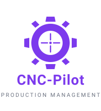

<p align="center">
  
</p>

<h1 align="center">CNC-Pilot</h1>

<p align="center">
  <a href="https://cnc-pilot-mvp.vercel.app"></a>
  <a href="https://nextjs.org/"></a>
  <a href="https://www.typescriptlang.org/"></a>
  <a href="https://supabase.com/"></a>
  <a href="#testing"></a>
  <a href="LICENSE"></a>
</p>

<p align="center">
  <strong><a href="https://cnc-pilot-mvp.vercel.app">Live Demo</a></strong> · <strong><a href="https://cnc-pilot-mvp.vercel.app/docs">Documentation</a></strong> · <strong><a href="./CHANGELOG.md">Changelog</a></strong>
</p>

---

## From spreadsheet chaos to full production control.

CNC-Pilot is a **production management platform** built for CNC manufacturing workshops. It replaces scattered spreadsheets, WhatsApp groups, and paper notes with a single system that tracks every order from quote to delivery — with **20 AI features** that automate the tedious parts.

Built for shops with 3–50 people. Runs on Supabase + Vercel free tiers. Zero monthly cost.

---

## Core Use Cases

- **Order-to-Cash** — customer inquiry → AI-parsed quote → order → production plan → delivery → cost analysis
- **Shop Floor Control** — assign operators, track setup/run times per operation, monitor live progress on Kanban/Swimlanes
- **Inventory & Reorder** — stock levels, batch tracking, low-stock alerts, AI-powered auto-reorder (Wilson EOQ formula)
- **Quoting & Pricing** — paste an email or upload a PDF → AI extracts parts, matches inventory, generates quote with dynamic pricing
- **Quality Assurance** — Quick Measure flow, tolerance tracking, AI defect prediction (5-factor risk model)
- **Customer Intelligence** — CLV predictions, churn risk scoring, auto-tiering (VIP/Regular/New/Inactive)

---

## Highlights

- 🧩 **Multi-tenant SaaS** — Row Level Security on every table, email domain-based company isolation
- 🧠 **20 AI features** — Gemini 2.5 Flash (free tier, ~2.3% rate budget) powering everything from quote parsing to demand forecasting
- 📋 **Kanban + Swimlanes** — drag-and-drop order boards with @dnd-kit, optimistic UI, customer-grouped swimlanes
- ⏱️ **Built-in time tracking** — one-click timers tied to operations, automatic cost calculation
- 🔒 **Enterprise security** — RLS, rate limiting, input sanitization (DOMPurify), prompt injection protection
- 📊 **AI-powered analytics** — revenue forecasting, demand prediction (SMA-3 + seasonality), dynamic pricing engine
- 🌍 **Multi-language** — Polish & English with typed translation wrappers
- 🌓 **Dark mode** — full violet/gray design system with Geist Sans
- ✅ **Tested** — 681+ unit tests (Vitest) + 47 E2E tests (Playwright), CI/CD via GitHub Actions
- ⚡ **Modern stack** — Next.js 16 App Router, React 19 Server Components, TypeScript 5, Tailwind CSS 4

---

## Screenshots

> **Screenshots coming soon.** See the **[Live Demo](https://cnc-pilot-mvp.vercel.app)** for the actual interface.

<!--
Replace placeholders with real screenshots. Recommended: 800x450 PNG, dark theme.
Save to: docs/screenshots/ or public/screenshots/

<table>
  <tr>
    <td></td>
    <td></td>
    <td></td>
  </tr>
  <tr>
    <td align="center">Dashboard</td>
    <td align="center">Kanban Board</td>
    <td align="center">Order Detail</td>
  </tr>
  <tr>
    <td></td>
    <td></td>
    <td></td>
  </tr>
  <tr>
    <td align="center">Production Execution</td>
    <td align="center">Inventory Management</td>
    <td align="center">AI Features</td>
  </tr>
</table>
-->

---

## Architecture Overview

- 🏢 **Multi-tenant** — `company_id` scoping on all tables. Email domain-based registration. Blocked public domains. Database-level RLS isolation.
- 🔐 **Security** — Supabase Auth + RLS on every table. Rate limiting, DOMPurify sanitization, AI prompt injection protection.
- 🧠 **AI layer** — Unified `callGemini<T>()` client with structured JSON output, generic caching (`ai_cache` table, configurable TTL), company-scoped.
- ⚡ **Performance** — React 19 Server Components, parallel data fetching, optimistic UI with rollback, ~2s cold start (Turbopack).
- 📦 **Modular** — Each domain (orders, production, inventory, customers, quotes) is a self-contained module with its own routes, components, and server actions.

---

## AI Features

20 AI features powered by **Gemini 2.5 Flash** (free tier):

| Phase | Features |
|-------|----------|
| **Phase 0 — Cleanup** | Unified Gemini client, report summary dedup, prompt injection sanitizer |
| **Phase 1 — Quick Wins** | Smart anomaly explanations, CLV predictions, feedback loop, auto-tagging |
| **Phase 2 — Production AI** | AI production plan generator, predictive deadlines, order auto-fill, PDF/image quote import, smart deadline manager, auto-reorder materials |
| **Phase 3 — Analytics** | Dynamic pricing engine, demand forecasting, quality defect prediction, revenue forecasting |
| **AI Expansion** | Report AI summaries (4 pages), customer intelligence (churn risk), inventory predictions (stockout forecasting) |

---

## Tech Stack

| Layer | Technology |
|-------|-----------|
| **Framework** | Next.js 16 (App Router, Turbopack) |
| **UI** | React 19, Tailwind CSS 4, shadcn/ui |
| **Language** | TypeScript 5 |
| **Database** | Supabase (PostgreSQL + Auth + RLS) |
| **AI** | Gemini 2.5 Flash (free tier) |
| **Forms** | React Hook Form + Zod |
| **Drag & Drop** | @dnd-kit |
| **Testing** | Vitest (681+ unit) + Playwright (47 E2E) |
| **CI/CD** | GitHub Actions → Vercel |

---

## Getting Started

### Prerequisites

- Node.js 18+
- Supabase account ([free tier](https://supabase.com))

### Quick Start

```bash
git clone https://github.com/JakubRen/cnc-pilot-mvp.git
cd cnc-pilot-mvp
npm install

cp .env.example .env.local
# Fill in NEXT_PUBLIC_SUPABASE_URL and NEXT_PUBLIC_SUPABASE_ANON_KEY

npm run dev
```

Open [http://localhost:3000](http://localhost:3000)

### Database Setup

1. Create a new Supabase project
2. Run `migrations/DAY_10_COMPLETE_SETUP.sql` in the SQL editor

### Migrations

Full docs: **[SMART_MIGRATIONS.md](./SMART_MIGRATIONS.md)**

```bash
npm run migrate:status          # What's applied/pending
npm run migrate:diff            # Compare TEST vs PROD
npm run migration:new <name>    # Create new migration
npm run migration:show <name>   # Display SQL
```

---

## Testing

```bash
# Unit tests (Vitest)
npm run test              # Run all
npm run test:watch        # Watch mode
npm run test:coverage     # Coverage

# E2E tests (Playwright)
npm run test:e2e          # Headless
npm run test:e2e:ui       # Interactive
```

---

## Recent Updates

| Date | Update |
|------|--------|
| 2026-02-14 | Customer Detail Page Redesign + CLV Panel with 8 metrics |
| 2026-02-13 | AI Master Plan Phases 0-3 — 20 AI features, 681+ unit tests |
| 2026-02-11 | AI Expansion Sprint + Kanban & Swimlanes Views |

**[View Full Changelog →](./CHANGELOG.md)**

---

## License

MIT — see [LICENSE](LICENSE) for details.

---

## Author

**Jakub Ren** — Product Manager & AI-Assisted Development Specialist

- **GitHub:** [@JakubRen](https://github.com/JakubRen)
- **Email:** jakub.renkowski@outlook.com

**Built as a comprehensive production management solution for CNC manufacturing**, combining enterprise-grade architecture with practical shop floor needs. Developed using AI-assisted development with **[Claude Code](https://claude.com/claude-code)**, demonstrating how Product Managers can leverage AI tools to build production-ready SaaS applications.

---

<p align="center">
  Built with
  <a href="https://nextjs.org/">Next.js</a> ·
  <a href="https://ui.shadcn.com/">shadcn/ui</a> ·
  <a href="https://supabase.com/">Supabase</a> ·
  <a href="https://ai.google.dev/">Gemini</a> ·
  <a href="https://vercel.com/">Vercel</a> ·
  <a href="https://claude.com/claude-code">Claude Code</a>
</p>
