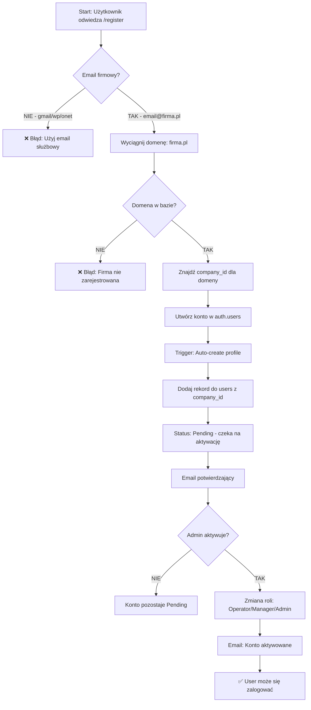
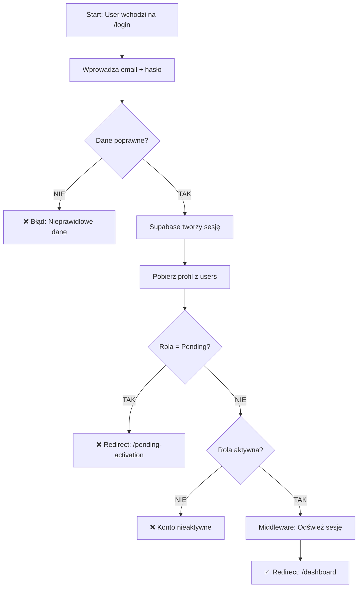
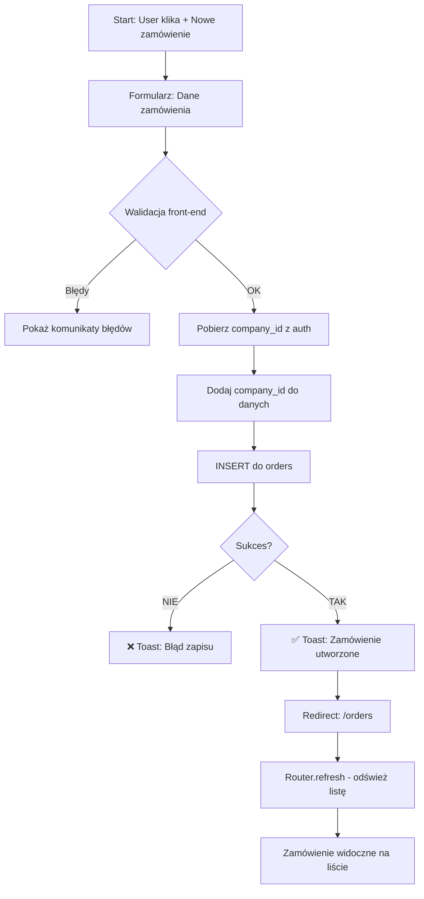
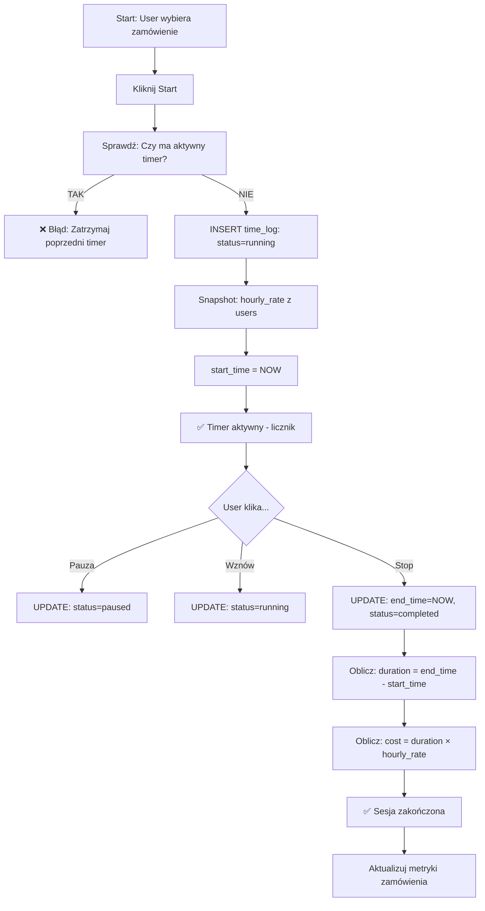
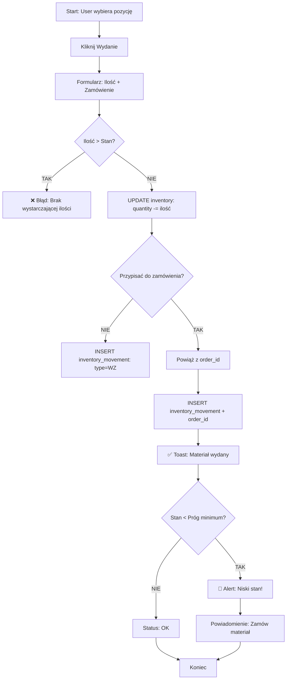
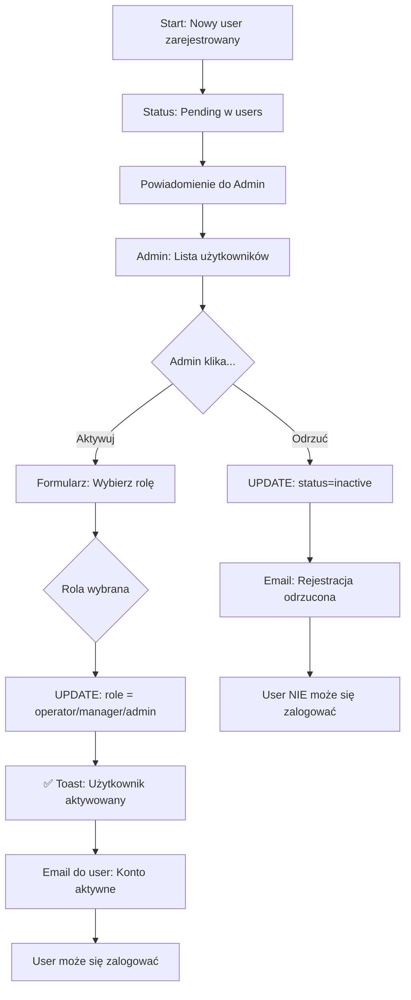
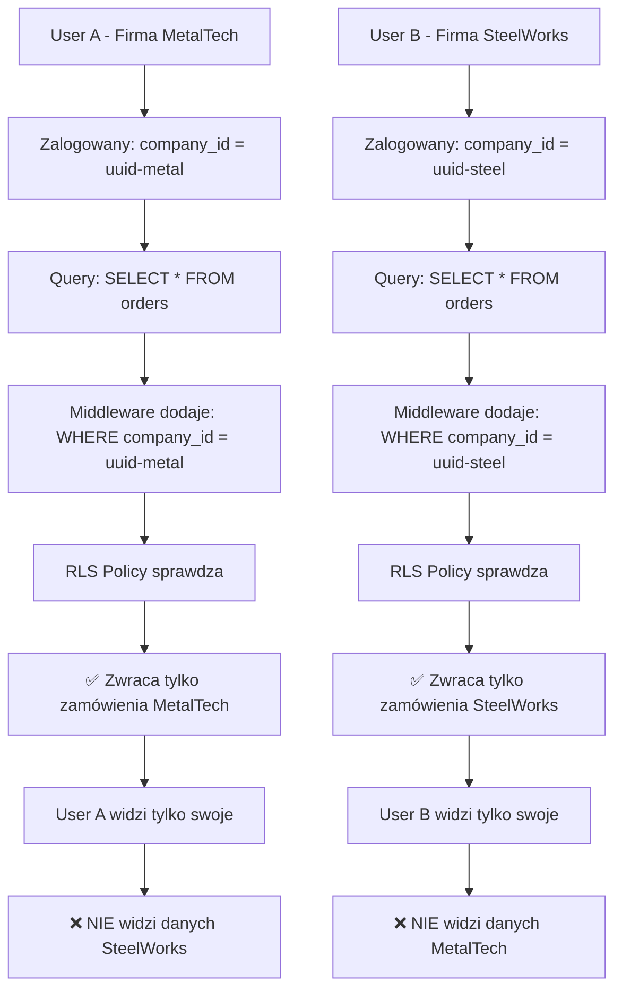
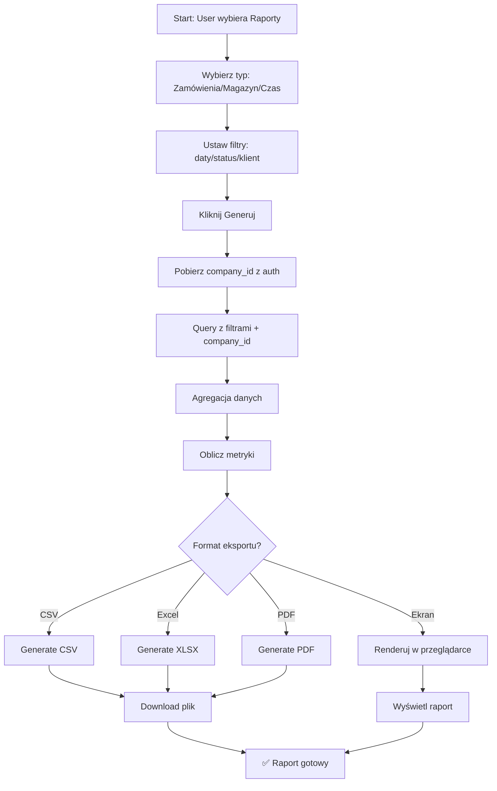

# Diagramy procesów (Flowcharts)

Wizualne przedstawienie przepływu pracy w systemie CNC-Pilot.

## 👤 Proces rejestracji użytkownika

**Kluczowe punkty:**
- Tylko służbowe emaile
- Automatyczne przypisanie do firmy po domenie
- Wymaga aktywacji przez admina

---

## 🔐 Proces logowania

**Kluczowe punkty:**
- Pending nie może się zalogować
- Session auto-refresh przez middleware
- Redirect do dashboard po sukcesie

---

## 📦 Tworzenie zamówienia

**Kluczowe punkty:**
- company_id zawsze z serwera, nigdy z clienta
- Toast feedback dla usera
- Router.refresh aby zobaczyć zmiany

---

## ⏱️ Śledzenie czasu pracy

**Kluczowe punkty:**
- Tylko 1 aktywny timer naraz
- Snapshot stawki (jeśli stawka się zmieni, stare sesje poprawne)
- Automatyczne obliczanie kosztu

---

## 📊 Wydanie materiału z magazynu

**Kluczowe punkty:**
- Walidacja przed wydaniem
- Automatyczne alerty niskiego stanu
- Historia ruchów magazynowych

---

## 👥 Aktywacja użytkownika przez admina

**Kluczowe punkty:**
- Pending = brak dostępu
- Admin wybiera rolę podczas aktywacji
- Email feedback do usera

---

## 🔄 Multi-Tenancy - Izolacja danych

**Kluczowe punkty:**
- Każdy query filtrowany po company_id
- RLS zapewnia izolację na poziomie bazy
- Niemożliwe przypadkowe wyciek danych

---

## 📈 Generowanie raportu

**Kluczowe punkty:**
- Zawsze filtruj po company_id
- Wiele formatów eksportu
- Zapisywanie ulubionych raportów

---

## 🔧 Notacja

**Kształty:**
- 🟦 Prostokąt - Proces/akcja
- 🔷 Romb - Decyzja (TAK/NIE)
- 🔴 Okrąg - Start/Stop
- 📄 Dokument - Output/raport

**Kolory:**
- ✅ Zielony - Sukces
- ❌ Czerwony - Błąd
- 🔵 Niebieski - Proces
- 🟡 Żółty - Czekanie/pending

---

## 📚 Więcej diagramów

Potrzebujesz flowchart dla innego procesu?

**Zgłoś prośbę:**
- Email: docs@cnc-pilot.app
- Temat: "Flowchart request: [nazwa procesu]"

**Planowane:**
- Proces fakturowania
- Integracja z systemami zewnętrznymi
- Backup i restore danych
- Migracja między planami cenowymi

---

## 🛠️ Narzędzia

Diagramy stworzone w:
- **Mermaid.js** - Markdown-based diagramming
- **Draw.io** - Bardziej skomplikowane diagramy

**Edytuj własne:**
- [Mermaid Live Editor](https://mermaid.live)
- [Draw.io](https://app.diagrams.net)

---

**Wizualizacja pomaga w zrozumieniu!** 🎯

Jeśli coś jest niejasne - zobacz [FAQ](/docs/faq) lub [Video Tutoriale](/docs/video-tutorials).
